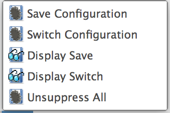

# stateSaver
Fusion 360 Addin to Save Suppresion State

## Usage:
First see [How to install sample Add-Ins and Scripts](https://rawgit.com/AutodeskFusion360/AutodeskFusion360.github.io/master/Installation.html)

This addin allows you to save and retrieve the suppresion and display states of components in the graphics window.

See a video here: TODO

Select **Save Configuration** to save the current suppression state of all features in the timeline.

Select **Switch Configuration** and select a saved config from the drop down it will revert the suppression of features to that condition.  New parts will retain their current state.  Selecting Current or cancel will revert to the suppression state of all components when you entered the command.

Select **Save Display** to save the current display state (lightbulb on/off) of all _components_ in the timeline.

Select **Switch Display** and select a saved display state from the drop down it will revert the display of _components_ to that condition.  New parts will retain their current state.  Selecting Current or cancel will revert to the display state of all components when you entered the command.

Alternatively you can select "Unsuppress All"  and it will simply unsuppress all features in the timeline.  

## Limitations
  * Currently no way to delete saved states
  * Seen issues with more complex history trees failing when you unsuppress many features at once.

## License
Samples are licensed under the terms of the [MIT License](http://opensource.org/licenses/MIT). Please see the [LICENSE](LICENSE) file for full details.

## Written by

Created by Patrick Rainsberry   (Autodesk Fusion 360 Business Development)
